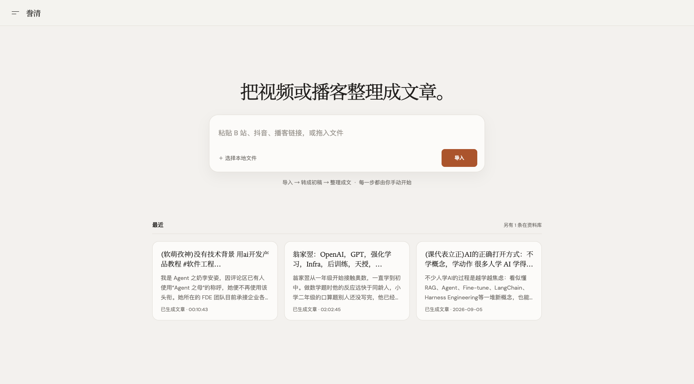
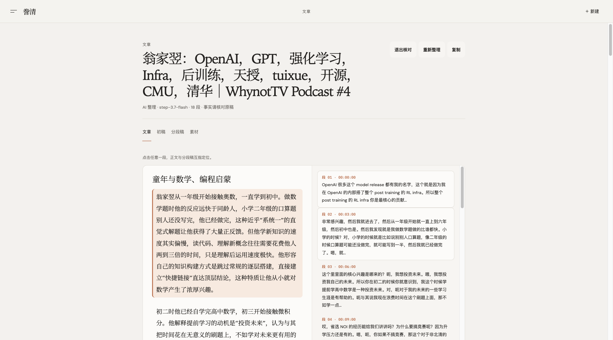
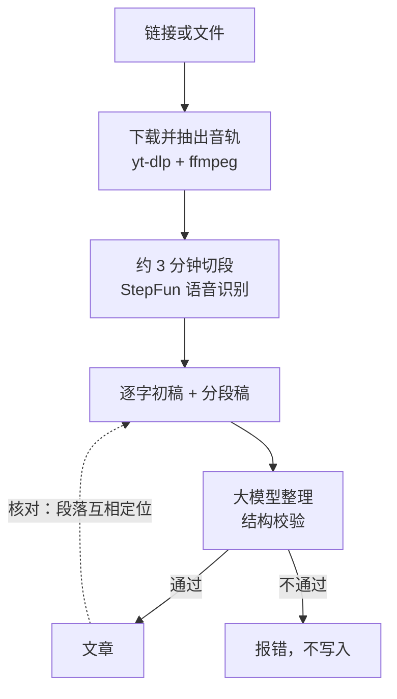

<div align="center">

# 誊清

**把视频或播客整理成一篇可读、可核对的文章。**

Turn a video or podcast into a readable article you can check against the source.

[在线使用](https://lcw.yishuziyu.cn) · [自部署](#自部署推荐) · [文档](docs/README.md)

  

</div>



## 为什么做它

听完一期两小时的播客，想回头找某个观点，只能拖进度条。AI 总结又常常丢细节、添油加醋，你没法知道哪句话是嘉宾真说过的。

誊清把音频先转成逐字稿，再整理成有标题、有段落的文章，并且**每一段都能对回原稿**。读得顺，也查得到出处。

## 功能

- **导入**：B 站、抖音、YouTube、小宇宙等播客页面、媒体直链，或者本地音视频文件。分享口令整段粘进来也能识别出里面的链接。
- **转成初稿**：按约 3 分钟切段做语音识别，得到逐字初稿和带时间戳的分段稿。可以随时暂停，断点续转。
- **整理成文**：用大模型把初稿整理成有标题、有小节的文章。结构校验不通过的结果不会写入，不会用半成品冒充成品。
- **核对**：左边是文章，右边是原稿，点任意一段就能定位到它出自原稿的哪一段。
- **你掌控每一步**：导入、转写、整理都由你手动开始，不会自动消耗额度。



## 怎么用

### 在线使用

打开 <https://lcw.yishuziyu.cn>。未登录时是游客身份，每天有导入 5 次、转写 3 次、整理 3 次的额度，数据只有你自己能看到。

公开站点的服务器在国内，访问要经过境外线路，偶尔会打不开。想稳定使用，建议自部署。

### 自部署（推荐）

需要 [Docker](https://www.docker.com/) 和一个 [StepFun](https://platform.stepfun.com/) 密钥。

```bash
git clone https://github.com/yishu-ziyu/podcast-to-essay.git
cd podcast-to-essay/web

# 镜像内置 yt-dlp 独立二进制，构建前先下载（按你的 CPU 选一个）
mkdir -p ytdlp-assets
curl -fL -o ytdlp-assets/yt-dlp_linux \
  https://github.com/yt-dlp/yt-dlp/releases/latest/download/yt-dlp_linux          # x86_64
curl -fL -o ytdlp-assets/yt-dlp_linux_aarch64 \
  https://github.com/yt-dlp/yt-dlp/releases/latest/download/yt-dlp_linux_aarch64  # ARM，如 Apple 芯片的 Mac

cp ../.env.example .env     # 填入 STEP_API_KEY
docker compose up -d --build
```

打开 <http://localhost:8787>。数据保存在 Docker 卷 `data` 里，升级镜像不会丢失；备份方法见 [deploy/BACKUP.md](deploy/BACKUP.md)。

只在自己电脑上用时，`ACCESS_PASSWORD` 可以留空，此时所有人都是所有者。**部署到公网时务必设置**，设置后，没有密码的访客是游客，受每日额度限制。

### 本地开发

需要 Node ≥ 18、`ffmpeg`、`yt-dlp`（≥ 2026.07.04）。

```bash
cp .env.example .env.local  # 在仓库根目录，填入 STEP_API_KEY
cd web
npm install
npm run dev                 # 前端 :5173，服务端 :8787
```

数据写在仓库根目录的 `raw/`、`cleaned/`、`jobs/` 下，这些目录不入库。端口被占用时的启动方式见 [AGENTS.md](AGENTS.md)。

| 命令 | 作用 |
|---|---|
| `npm test` | 服务端与前端单元测试 |
| `npx tsc --noEmit -p .` | 类型检查 |
| `npm run build` | 构建前端 |

## 配置

完整列表和默认值见 [.env.example](.env.example)，常用的是这几项：

| 变量 | 说明 |
|---|---|
| `STEP_API_KEY` | **必填。** StepFun 密钥，用于语音识别和文章整理 |
| `ACCESS_PASSWORD` | 所有者密码。不设置则所有人都是所有者 |
| `GUEST_INGEST_PER_DAY` / `GUEST_TRANSCRIBE_PER_DAY` / `GUEST_CLEAN_PER_DAY` | 游客每日额度，默认 5 / 3 / 3 |
| `MAX_UPLOAD_BYTES` | 单个上传文件上限，默认 512 MB |
| `YTDLP_COOKIES` | 需要登录才能下载的站点，可提供 yt-dlp 的 cookies 文件 |

## 工作原理



前端是 React + Vite，服务端是不依赖第三方包的 Node 程序。每一期节目是一个条目：原音轨、初稿、分段稿和文章都存在同一个条目下。细节见 [docs/architecture.md](docs/architecture.md)。

## 目录

```
podcast-to-essay/
├── web/            应用：前端 src/、服务端 server/、Dockerfile
├── deploy/         线上部署、备份脚本、Vercel 网关
├── docs/           架构、接口、数据格式、决策记录、测试记录
├── .env.example    配置示例
└── AGENTS.md       给 AI 编码助手的工作规则
```

## 文档

- [docs/README.md](docs/README.md)：文档地图，包括架构、接口、数据格式、决策记录、问题清单和测试记录
- [deploy/REDEPLOY.md](deploy/REDEPLOY.md)：线上部署与服务器现状
- [AGENTS.md](AGENTS.md)：给 AI 编码助手的工作规则

## 许可证

[MIT](LICENSE)
