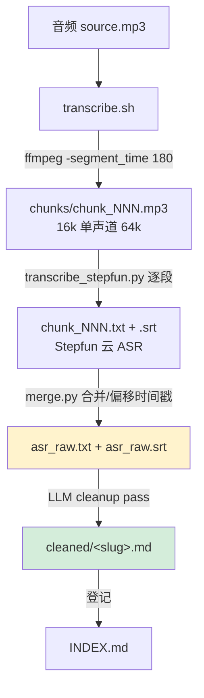

# 01 · 整体架构

## 1.1 系统上下文

`podcast-to-essay` 处于一个**分层**结构中，自己只负责编排与产物管理，真正的识别能力委托给外部 skill：

```
┌──────────────────────────────────────────────────────────────┐
│  podcast-to-essay  (本仓库 = 编排 + 数据 + 文档)              │
│                                                                │
│   raw/<slug>/transcribe.sh  ──调用──▶  外部 ASR 引擎           │
│        │                                     │                │
│        │                          ~/.claude/skills/           │
│        │                          asr-transcript-refinement/  │
│        │                          scripts/                    │
│        │                                     │                │
│        ├─ ffmpeg 切块 ─────────────────────────┘             │
│        ├─ 逐段 transcribe_stepfun.py (Stepfun 云)             │
│        └─ merge.py 合并                                       │
│                                                                │
│   产出: raw/<slug>/asr_raw.*  →  LLM cleanup  →  cleaned/*.md │
└──────────────────────────────────────────────────────────────┘
```

**关键边界**：仓库不知道 ASR 模型细节，只知道"给一个音频片段，返回 `.txt` + `.srt`"。模型权重、API、SSE 解析都在外部 skill / Stepfun 云端。

## 1.2 处理流水线（3 步）



- **raw 阶段**（步骤 1–2，脚本化）：音频 → 切块 → 逐块识别 → 合并。产物带时间戳。
- **cleaned 阶段**（步骤 3，LLM 主体）：读取 `asr_raw.*`，按 [转录标准](07-conventions.md) 清洗成纯净段落流。
- 步骤 3 是 **LLM 在主线程完成的工作**，不是脚本（引擎 `SKILL.md` 明确："这个不是脚本，是 LLM 看到 SRT/TXT 后做的工作"）。

## 1.3 后端切换逻辑（属于外部引擎，非本仓库）

> 注意：本仓库的 `transcribe.sh` **绕过**了引擎的后端选择，直接硬编码调用 `transcribe_stepfun.py`（即永远走 Stepfun 云端）。下面的切换逻辑是引擎 `pipeline.sh` 的能力，供理解整体设计。

引擎 `pipeline.sh` 用环境变量 `STEP_ASR_BACKEND` 选择后端：

| `STEP_ASR_BACKEND` | 后端 | 行为 |
|--------------------|------|------|
| 未设置 / 其它 | `nano`（**默认**） | 调用本地 `transcribe_funasr.py`（GGUF，内置 VAD，不切块） |
| `=stepfun` | `stepfun` | `split.sh` 切块 180s → 逐块 `transcribe_stepfun.py` → `merge.py` |

设计变更：早期按 `STEP_API_KEY` 是否存在自动切 Stepfun，但因用户始终设有该 key（用于其它工具），导致每次误走云端，故改为需**显式 opt-in**（`STEP_ASR_BACKEND=stepfun`）。

## 1.4 模块职责总览

| 模块 | 位置 | 职责 |
|------|------|------|
| 编排脚本 | `raw/<slug>/transcribe.sh` | 切块 → 逐段 ASR → 合并，产出 `asr_raw.*` |
| ASR 云端客户端 | `~/.claude/skills/.../transcribe_stepfun.py` | 调用 Stepfun SSE 接口，单段识别 |
| 合并器 | `~/.claude/skills/.../merge.py` | 多段 SRT/TXT 合并、时间戳偏移、重新编号 |
| 切块器 | `~/.claude/skills/.../split.sh` | ffmpeg 长音频切片为 16k 单声道 WAV |
| 一键入口 | `~/.claude/skills/.../pipeline.sh` | 选后端并串起整个转写 |
| 校验器 | `~/.claude/skills/.../verify.sh` | cleanup 后 grep 已知坏模式 |
| 清理器 | `~/.claude/skills/.../cleanup.sh` | 删 ASR 中间产物（chunks） |
| 安装脚本 | `~/.claude/skills/.../setup.sh` | 旧 PyTorch FunASR 后端 venv（默认 nano 已不用） |
| 摄入模板 | `~/.claude/skills/.../ingest-prompt.md` | 给 agent 的"转录→知识库"指令（超出本仓库范围） |
| 标准化清洗 | LLM（主线程，无脚本） | 删时间戳 / 合段落 / 替换说话人 |
| 登记 / 风格 | `INDEX.md` / `STYLE_NOTES.md` | 期次状态 / 风格学习笔记 |
